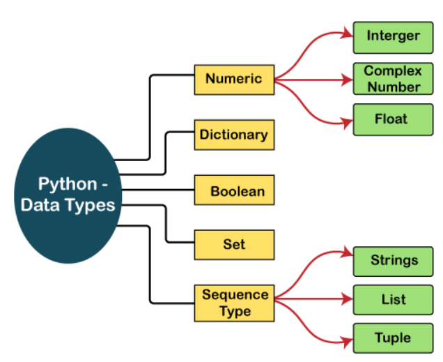

# Data types

---
Store different type of values in a variable

| Name         | data type          |
|--------------|--------------------|
| Numeric type | int,float,complex  |
| Sequence     | list, tuple,string |
| mapping      | dict               |
| set type     | set and frozenset  |
| boolean type | bool               |
| Binary type  | bytes,bytearray    |
| none type    | None               |



* You can get data type of any object using type() function
  ```python
  x = 7
  print(x)
  ```
  